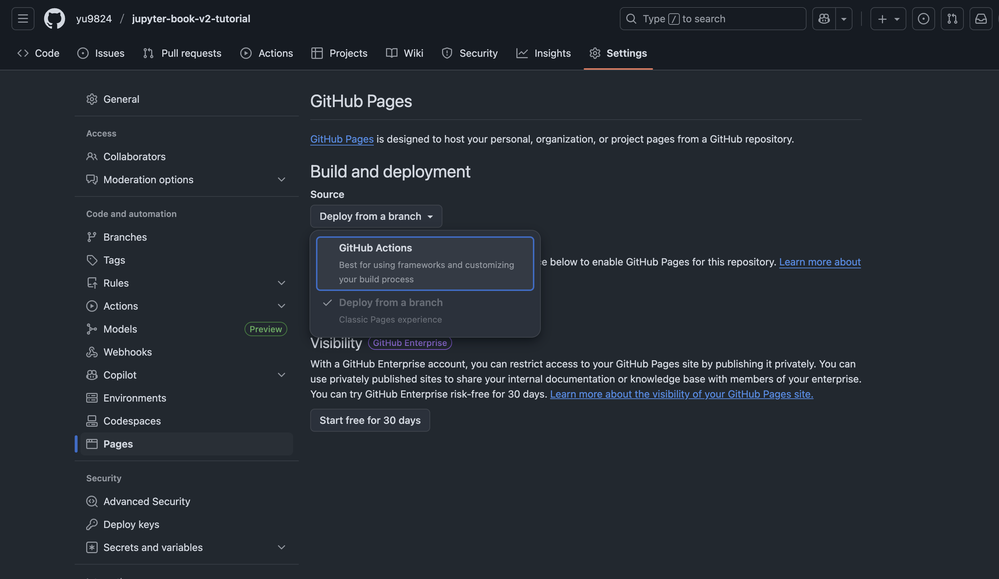

# jupyter-book-v2-tutorial

## Environments

```bash
conda create -yn jupyter-book-v2 python=3.12 --file ./requirements.txt
```

## How to start

```bash
# myst.yml (設定ファイル) の自動生成。テストサーバーの立ち上げ
jupyter book
```

```
Welcome to the Jupyter Book (via myst) CLI! 🎉 🚀

jupyter book init walks you through creating a myst.yml file.

You can use Jupyter Book (via myst) to:

 - create interactive websites from markdown and Jupyter Notebooks 📈
 - build & export professional PDFs and Word documents 📄

Learn more about this CLI and MyST Markdown at: https://jupyterbook.org/stable


💾 Updating .gitignore
💾 Writing new project and site config file: myst.yml

? Would you like to run jupyter book start now? Yes
🔍 Querying template metadata from https://api.mystmd.org/templates/site/myst/book-theme
🐕 Fetching template from https://github.com/myst-templates/book-theme/archive/refs/heads/main.zip
💾 Saved template to path _build/templates/site/myst/book-theme
⤵️  Installing web libraries (can take up to 60 s)
📦 Installed web libraries in 7.69 s
📖 Built chapter-1.ipynb in 72 ms.
📖 Built README.md in 72 ms.
📖 Built index.md in 76 ms.
📚 Built 3 pages for project in 131 ms.


        ✨✨✨  Starting Book Theme  ✨✨✨


🔌 Server started on port 3000!  🥳 🎉


        👉  http://localhost:3000  👈


(node:6444) [DEP0169] DeprecationWarning: `url.parse()` behavior is not standardized and prone to errors that have security implications. Use the WHATWG URL API instead. CVEs are not issued for `url.parse()` vulnerabilities.

```

```bash
# github pagesデプロイ向けの actions workflowの追加
jupyter book init --gh-pages
```

```
📝 Creating a GitHub Action to deploy your MyST Site

? What branch would you like to deploy from? main
? What would you like to call the action? deploy.yml

🎉 GitHub Action is configured:

.github/workflows/deploy.yml

✅ Next Steps

1. Navigate to your GitHub Pages settings

    https://github.com/yu9824/jupyter-book-v2-tutorial/settings/pages

2. Enable GitHub Pages
3. Use GitHub Actions as the source
4. Push these changes (and/or merge to main)
5. Look for a new action to start

    https://github.com/yu9824/jupyter-book-v2-tutorial/actions

6. Once the action completes, your site should be deployed at:

    https://yu9824.github.io/jupyter-book-v2-tutorial

7. 🎉 Celebrate and tell us about your site on BlueSky or Mastodon! 🐦 🐘

```

> 1. Navigate to your GitHub Pages settings
>
>     https://github.com/yu9824/jupyter-book-v2-tutorial/settings/pages
>
> 2. Enable GitHub Pages
> 3. Use GitHub Actions as the source



```bash
# TOC設定の追加
jupyter book init --write-toc
```

```
✅ Project already initialized with config file: myst.yml
✅ Site already initialized with config file: myst.yml
💾 Writing new TOC to: myst.yml
```


```bash
# テストサーバー起動
jupyter book start
```


## Root Page

The “root” of a site is the page displayed when someone browses to the index of your site without any pathname. The CLI will choose the root file in the following order:

1. index.md / README.md / main.md
2. index.tex / README.tex / main.tex
3. index.ipynb / README.ipynb / main.ipynb
4. The first .md file found alphabetically
5. The first .tex file found alphabetically
6. The first .ipynb file found alphabetically

## Settings

- See [Exporting overview](https://mystmd.org/guide/documents-exports)

```yaml
# See docs at: https://mystmd.org/guide/frontmatter
version: 1
project:
  id: cac19e7d-9d56-4ba6-8d19-624e0a97f41a
  title: Jupyter book v2 tutorial
  # description:
  # keywords: []
  authors:
    - name: yu9824
      github: yu9824
      x: yu_9824
  github: yu9824/jupyter-book-v2-tutorial
  # To autogenerate a Table of Contents, run "jupyter book init --write-toc"
  toc:
    # Auto-generated by `myst init --write-toc`
    - file: README.md  # ホーム
    - file: chapter-1.ipynb
    - title: Chapter 2  # indexなくてもOK
      children:
      - file: chapter-2-1.ipynb
    - file: chapter-3.md
      children:
      - file: chapter-3-1.ipynb
site:
  title: Jupyter book v2 tutorial
  template: book-theme
  options:
    outline_maxdepth: 2
    favicon: imgs/favicon.png
    logo: imgs/site_logo.png
    logo_dark: imgs/site_logo_dark.png

```
